# Resurface — Complete Implementation Blueprint (v2.0)

> **One-Liner:** *"Resurface: Save anything. AI categorizes and summarizes. Find it with natural language. Dual-LLM with automatic fallback — it adapts to whichever API keys you have."*

---

## 📋 Table of Contents

1. [Problem Statement](#-problem-statement)
2. [Solution](#-solution)
3. [Architecture Overview](#-architecture-overview)
4. [The 4 Automatic User Scenarios](#-the-4-automatic-user-scenarios)
5. [Project Structure](#-project-structure)
6. [Data Models](#-data-models)
7. [Core Files Deep Dive](#-core-files-deep-dive)
8. [Feature Specification](#-feature-specification)
9. [User Flow Diagrams](#-user-flow-diagrams)
10. [Tech Stack](#-tech-stack)
11. [Dependencies](#-dependencies)
12. [Implementation Phases](#-implementation-phases)
13. [API Integration Details](#-api-integration-details)
14. [Demo Script](#-demo-script)
15. [Deployment Guide](#-deployment-guide)
16. [Future Monetization Path](#-future-monetization-path)

---

## 📋 Problem Statement

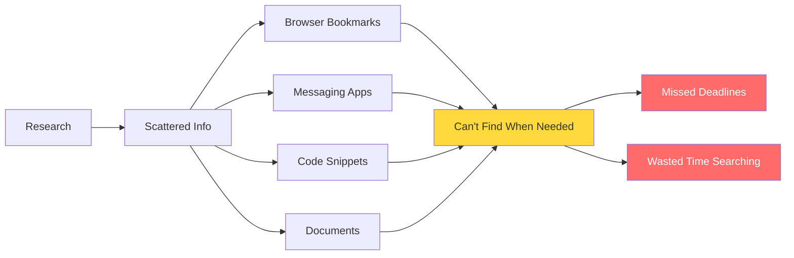

In deadline-driven workflows, critical information—links, notes, code snippets, references—gets scattered across browsers, messaging apps, and documents. When time runs out, users waste precious minutes searching through bookmarks and history. Existing tools store information passively but never proactively surface the right resource at the right moment. **The gap is not storage—it's context-aware retrieval under time pressure.**

---

## 💡 Solution

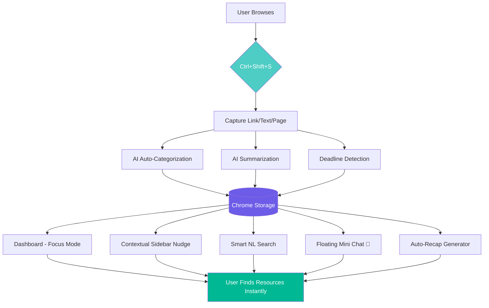

Resurface is a browser extension that acts as a **deadline-aware knowledge companion**. It captures, categorizes, and—most critically—**proactively resurfaces** your saved resources exactly when you need them, based on your current project and urgency.

---

## 📐 Architecture Overview

```mermaid
graph TB
    subgraph "Chrome Extension (Manifest V3)"
        BG[background.js<br/>Service Worker]
        POP[popup/<br/>React SPA]
        CS[content-script.js<br/>Page Injection]
        
        BG -->|Commands API| CMD[Ctrl+Shift+S]
        BG -->|Context Menus| CTX[Right-Click]
        BG -->|Tabs API| TAB[URL Detection]
        BG -->|Alarms API| ALM[Deadline Alerts]
        BG -->|Messages| POP
        BG -->|Messages| CS
        
        CS -->|Sidebar| SIDE[Contextual Nudge]
        CS -->|Floating UI| CHAT[Mini Chat 💬]
        CS -->|Selection| SUMM[Page Summary]
        
        POP -->|React| DASH[Dashboard]
        POP -->|React| FOCUS[Focus Mode]
        POP -->|React| SET[Settings]
        POP -->|React| SRCH[Search]
    end
    
    subgraph "Storage Layer"
        STORE[(chrome.storage.local)]
        STORE --> ITEMS[items[]]
        STORE --> PROJ[projects[]]
        STORE --> KEYS[groqApiKey<br/>geminiApiKey]
    end
    
    subgraph "AI Layer"
        LLC[llmClient.js<br/>Auto-Detection]
        LLC -->|Primary| GROQ[Groq API<br/>Llama 3.1 8B<br/>~0.5s latency]
        LLC -->|Fallback| GEM[Gemini API<br/>Flash 2.0<br/>~1.2s latency]
        LLC -->|Format| CONV[OpenAI→Gemini<br/>Converter]
    end
    
    BG <--> STORE
    POP <--> STORE
    CS <--> STORE
    BG --> LLC
    POP --> LLC
    CS --> LLC
    
    style BG fill:#0984e3,color:#fff
    style POP fill:#6c5ce7,color:#fff
    style CS fill:#00b894,color:#fff
    style LLC fill:#e17055,color:#fff
    style STORE fill:#2d3436,color:#fff
```

### Component Communication Flow

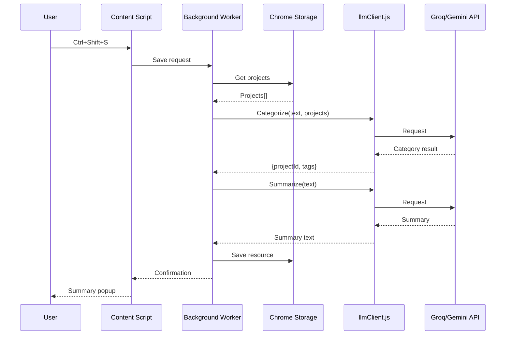

---

## ⭐ The 4 Automatic User Scenarios

```mermaid
graph TD
    START[Extension Installed] --> CHECK{Check Storage}
    
    CHECK -->|Has Groq Key Only| GONLY[Use Groq Only]
    CHECK -->|Has Gemini Key Only| GMONLY[Use Gemini Only]
    CHECK -->|Has Both Keys| BOTH[Use Both]
    CHECK -->|No Keys| NONE[Show Onboarding]
    
    GONLY --> GFLOW[All Features via Groq]
    GMONLY --> GMFLOW[All Features via Gemini]
    
    BOTH --> ORDER{preferredOrder?}
    ORDER -->|groq-first| GFIRST[Try Groq → Fallback Gemini]
    ORDER -->|gemini-first| GMFIRST[Try Gemini → Fallback Groq]
    
    GFIRST --> GSUCC{Groq OK?}
    GSUCC -->|Yes| GUSE[Use Groq Result]
    GSUCC -->|No| GMFALL[Fallback to Gemini]
    
    GMFIRST --> GMSUCC{Gemini OK?}
    GMSUCC -->|Yes| GMUSE[Use Gemini Result]
    GMSUCC -->|No| GFALL[Fallback to Groq]
    
    NONE --> ONBOARD[Settings Page<br/>"Add at least one key"]
    
    GFLOW --> DONE[Feature Complete]
    GMFLOW --> DONE
    GUSE --> DONE
    GMFALL --> DONE
    GMUSE --> DONE
    GFALL --> DONE
    
    style START fill:#6c5ce7,color:#fff
    style NONE fill:#ff6b6b,color:#fff
    style DONE fill:#00b894,color:#fff
    style GSUCC fill:#fdcb6e
    style GMSUCC fill:#fdcb6e
```

| User Has | System Behavior | Latency | Resilience |
|:---|:---|:---|:---|
| **Only Groq key** | Uses Groq for everything | ~0.5s | Groq fails → shows error |
| **Only Gemini key** | Uses Gemini for everything | ~1.2s | Gemini fails → shows error |
| **Both keys** | Groq first, then Gemini | 0.5s / 1.2s fallback | Full resilience |
| **Neither key** | Shows onboarding: "Add at least one key" | N/A | Features disabled |

**Zero configuration required. No toggle. No dropdown. It just works.**

---

## 🗂️ Project Structure

```
resurface-extension/
│
├── manifest.json                    # Chrome Extension manifest V3
├── package.json                     # Node dependencies & scripts
├── vite.config.js                   # Vite build configuration
├── tailwind.config.js               # Tailwind CSS configuration
├── postcss.config.js                # PostCSS for Tailwind
├── .gitignore
├── README.md
│
├── public/
│   └── icons/
│       ├── icon-16.png              # Toolbar icon (16x16)
│       ├── icon-48.png              # Extension management icon
│       └── icon-128.png             # Web Store listing icon
│
├── src/
│   ├── background/                  # Service Worker (persistent background)
│   │   ├── index.js                 # Entry point — registers all listeners
│   │   ├── commands.js              # Ctrl+Shift+S keyboard shortcut handler
│   │   ├── contextMenus.js          # Right-click "Resurface Summarize" menu
│   │   ├── tabListener.js           # tabs.onUpdated → triggers sidebar nudge
│   │   ├── alarms.js                # Deadline countdown alarms
│   │   └── messageHandler.js        # Central message router (popup ↔ content)
│   │
│   ├── popup/                       # React Dashboard (extension popup)
│   │   ├── index.html               # HTML entry for React SPA
│   │   ├── main.jsx                 # React DOM render entry
│   │   ├── App.jsx                  # Root component with routing
│   │   │
│   │   ├── components/
│   │   │   ├── Dashboard.jsx        # Main view: all projects & resources
│   │   │   ├── FocusMode.jsx        # Urgency-filtered view (closest deadline)
│   │   │   ├── ProjectCard.jsx      # Single project summary with progress
│   │   │   ├── ResourceItem.jsx     # Single saved resource with actions
│   │   │   ├── SearchBar.jsx        # Natural language search input
│   │   │   ├── Settings.jsx         # API keys management + live status
│   │   │   ├── ApiStatus.jsx        # Active provider indicator badge
│   │   │   ├── RecapGenerator.jsx   # Pre-deadline auto-recap UI
│   │   │   ├── SharePanel.jsx       # Share-to-team one-link interface
│   │   │   ├── Onboarding.jsx       # First-run setup wizard
│   │   │   └── Layout.jsx           # App shell with navigation
│   │   │
│   │   └── styles/
│   │       └── index.css            # Tailwind imports + custom styles
│   │
│   ├── content/                     # Content Scripts (injected into pages)
│   │   ├── contentScript.js         # Entry point — initializes all page features
│   │   ├── floatingChat.js          # 💬 Floating mini chat button & panel
│   │   ├── sidebarInjector.js       # Contextual sidebar nudging
│   │   └── pageExtractor.js         # Full page text extraction for summaries
│   │
│   └── utils/                       # Shared utility modules
│       ├── storage.js               # chrome.storage.local CRUD wrapper
│       ├── llmClient.js             # ⭐ Multi-LLM auto-detect & call router
│       ├── categorizer.js           # Groq/Gemini auto-categorization logic
│       ├── summarizer.js            # AI summarization (3-bullet, 1-sentence)
│       ├── deadlineParser.js        # Natural language date extraction
│       ├── smartSearch.js           # Hybrid NL search (local + AI)
│       ├── recapGenerator.js        # Pre-deadline project recap
│       ├── urlMatcher.js            # URL glob pattern matching
│       └── constants.js             # Shared constants & defaults
│
└── build/                           # Production output (gitignored)
    ├── manifest.json
    ├── assets/
    └── src/
```

---

## 📊 Data Models

### Project Schema

```javascript
{
  id: "uuid-v4",                          // Unique identifier
  name: "HackIndia 2025",                 // Display name
  description: "Annual hackathon",        // Optional description
  keywords: [                             // Auto-categorization triggers
    "hackathon",
    "pitch",
    "sponsor",
    "team"
  ],
  relatedUrls: [                          // Sidebar nudge triggers (glob patterns)
    "github.com/team/*",
    "figma.com/file/*",
    "docs.google.com/spreadsheets/*"
  ],
  deadline: "2025-04-25T23:59:59Z",      // ISO 8601 timestamp
  createdAt: "2025-04-01T08:00:00Z",
  updatedAt: "2025-04-24T14:30:00Z",
  color: "#FF6B6B",                       // UI accent color (hex)
  archived: false,                        // Soft delete flag
  resourceCount: 24                       // Cached count (denormalized)
}
```

### Resource Schema

```javascript
{
  id: "uuid-v4",                          // Unique identifier
  projectId: "uuid-v4",                   // FK → Project (auto-assigned)
  type: "link" | "text" | "page" | "voice", // Capture type
  
  // Content
  title: "How to Pitch to VCs in 2025",  // Auto-extracted or manual
  url: "https://example.com/vc-pitch",   // null for text snippets
  textContent: "The three key elements...", // Raw captured text (truncated)
  
  // AI-Generated
  summary: "3 key tips for...",          // Groq/Gemini 1-sentence summary
  bulletSummary: [                        // 3-bullet summary
    "Research VCs before pitching",
    "Lead with traction metrics",
    "Keep deck under 10 slides"
  ],
  tags: ["pitch", "investors", "VC"],    // Auto-generated tags
  
  // Deadline (optional)
  deadlineMentioned: null | "2025-04-20", // Date found in content
  deadlineSource: "text" | "manual",      // How it was detected
  
  // Meta
  accessCount: 7,                         // Read/click counter
  lastAccessed: "2025-04-24T14:00:00Z",
  savedAt: "2025-04-22T10:30:00Z",
  readStatus: "unread" | "read" | "archived",
  
  // Voice (optional)
  transcript: "",                         // Speech-to-text result
  audioBlobUrl: null,                     // Blob URL for playback
  
  // Source page info
  pageTitle: "VC Pitch Guide 2025",
  faviconUrl: "https://example.com/favicon.ico",
  
  // Provider info (for debugging)
  aiProvider: "groq" | "gemini"          // Which LLM generated this
}
```

### Share Link Schema

```javascript
{
  shareId: "abc123",                      // Short UUID for URL
  projectId: "uuid-v4",                   // Source project
  createdBy: "user@email.com",            // Optional identity
  createdAt: "2025-04-24T16:00:00Z",
  expiresAt: "2025-05-01T16:00:00Z",     // Optional expiry
  viewCount: 3,                           // Access counter
  resources: [                            // Snapshot of resource IDs
    "resource-id-1",
    "resource-id-2"
  ],
  isPasswordProtected: false,
  passwordHash: null                      // Optional bcrypt hash
}
```

### Entity Relationship Diagram

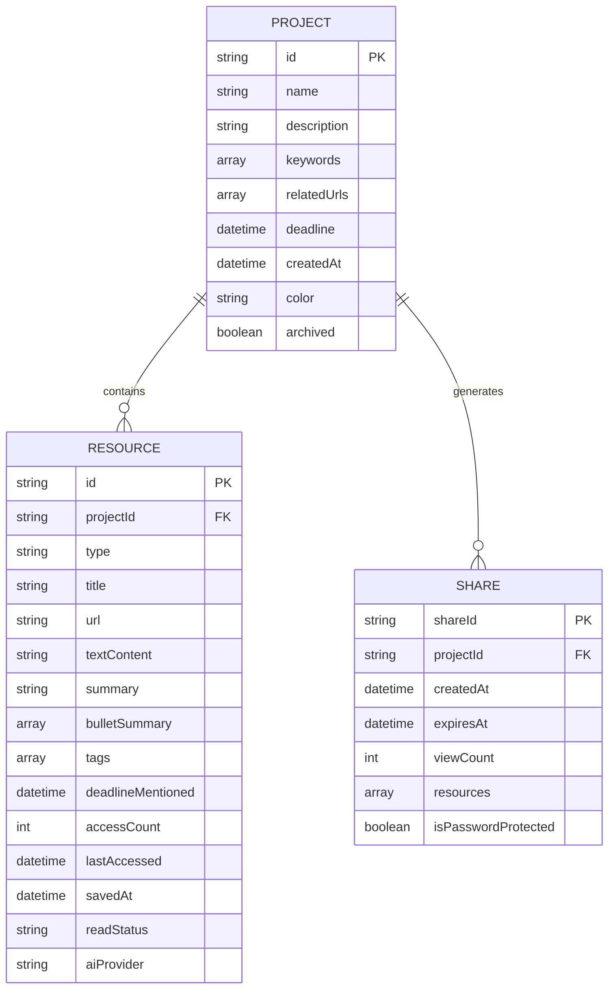

---

## ⭐ Core Files Deep Dive

### `utils/llmClient.js` — The Heart of Resurface

```javascript
// Auto-detects available API keys — no user config needed

const GROQ_MODEL = 'llama-3.1-8b-instant';
const GEMINI_MODEL = 'gemini-2.0-flash';

/**
 * PUBLIC API — Call this from everywhere
 * 
 * @param {Object} options
 * @param {Array} options.messages - OpenAI-format message array
 * @param {number} options.maxTokens - Max output tokens (default: 200)
 * @param {number} options.temperature - Creativity (default: 0.2)
 * @returns {Object} { text, usage, provider }
 */
async function callLLM({ messages, maxTokens = 200, temperature = 0.2 }) {
  const providers = await getAvailableProviders();
  
  if (providers.length === 0) {
    throw new Error(
      'No API keys configured. Open Settings (⚙️) and add at least one key.'
    );
  }
  
  // Try each provider in order until one succeeds
  for (const provider of providers) {
    try {
      const result = await provider.fn(
        provider.key, messages, maxTokens, temperature
      );
      return { ...result, provider: provider.name };
    } catch (error) {
      console.warn(`[LLM] ${provider.name} failed:`, error.message);
      continue; // Try next provider
    }
  }
  
  throw new Error('All configured LLM providers failed. Check your API keys.');
}

/**
 * DYNAMIC PROVIDER DETECTION
 * Reads chrome.storage.local to determine available providers
 * Respects user's preferredOrder setting
 */
async function getAvailableProviders() {
  const { groqApiKey, geminiApiKey, preferredOrder } = 
    await chrome.storage.local.get(['groqApiKey', 'geminiApiKey', 'preferredOrder']);
  
  const providers = [];
  const order = preferredOrder || 'groq-first'; // default: try Groq first
  
  if (order === 'gemini-first') {
    if (geminiApiKey) providers.push({ name: 'gemini', key: geminiApiKey, fn: callGemini });
    if (groqApiKey) providers.push({ name: 'groq', key: groqApiKey, fn: callGroq });
  } else {
    if (groqApiKey) providers.push({ name: 'groq', key: groqApiKey, fn: callGroq });
    if (geminiApiKey) providers.push({ name: 'gemini', key: geminiApiKey, fn: callGemini });
  }
  
  return providers;
}

/**
 * GROQ API CALL
 * Uses OpenAI-compatible endpoint
 * Free tier: 30 RPM, 6,000 TPM — very generous
 */
async function callGroq(apiKey, messages, maxTokens, temperature) {
  const response = await fetch('https://api.groq.com/openai/v1/chat/completions', {
    method: 'POST',
    headers: {
      'Authorization': `Bearer ${apiKey}`,
      'Content-Type': 'application/json',
    },
    body: JSON.stringify({
      model: GROQ_MODEL,
      messages,
      max_tokens: maxTokens,
      temperature,
    }),
    signal: AbortSignal.timeout(8000),
  });

  if (!response.ok) {
    const err = await response.json().catch(() => ({}));
    throw new Error(err.error?.message || `Groq HTTP ${response.status}`);
  }

  const data = await response.json();
  return {
    text: data.choices[0].message.content,
    usage: data.usage,
  };
}

/**
 * GEMINI API CALL
 * Uses Gemini-specific format — converted from OpenAI format
 * Free tier: 15 RPM — sufficient for personal use
 */
async function callGemini(apiKey, messages, maxTokens, temperature) {
  const contents = convertToGeminiFormat(messages);
  
  const response = await fetch(
    `https://generativelanguage.googleapis.com/v1beta/models/${GEMINI_MODEL}:generateContent?key=${apiKey}`,
    {
      method: 'POST',
      headers: { 'Content-Type': 'application/json' },
      body: JSON.stringify({
        contents,
        generationConfig: {
          maxOutputTokens: maxTokens,
          temperature,
        },
      }),
      signal: AbortSignal.timeout(8000),
    }
  );

  if (!response.ok) {
    const err = await response.json().catch(() => ({}));
    throw new Error(err.error?.message || `Gemini HTTP ${response.status}`);
  }

  const data = await response.json();
  return {
    text: data.candidates[0].content.parts[0].text,
    usage: data.usageMetadata,
  };
}

/**
 * FORMAT CONVERTER: OpenAI → Gemini
 * Gemini uses a different chat format than OpenAI
 */
function convertToGeminiFormat(messages) {
  const contents = [];
  for (const msg of messages) {
    if (msg.role === 'system') {
      // Gemini doesn't have system role — inject as user instruction
      contents.push({ role: 'user', parts: [{ text: `[Instruction]: ${msg.content}` }] });
      contents.push({ role: 'model', parts: [{ text: 'Understood.' }] });
    } else if (msg.role === 'user') {
      contents.push({ role: 'user', parts: [{ text: msg.content }] });
    } else if (msg.role === 'assistant') {
      contents.push({ role: 'model', parts: [{ text: msg.content }] });
    }
  }
  return contents;
}

/**
 * HEALTH CHECK
 * Tests all configured providers — used by Settings page
 */
async function checkProviderStatus() {
  const { groqApiKey, geminiApiKey } = 
    await chrome.storage.local.get(['groqApiKey', 'geminiApiKey']);
  
  const status = {};
  
  if (groqApiKey) {
    try {
      await callGroq(groqApiKey, [{ role: 'user', content: 'Hi' }], 10, 0);
      status.groq = { available: true, latency: '~0.5s', model: GROQ_MODEL };
    } catch (e) {
      status.groq = { available: false, error: e.message };
    }
  }
  
  if (geminiApiKey) {
    try {
      await callGemini(geminiApiKey, [{ role: 'user', content: 'Hi' }], 10, 0);
      status.gemini = { available: true, latency: '~1.2s', model: GEMINI_MODEL };
    } catch (e) {
      status.gemini = { available: false, error: e.message };
    }
  }
  
  return status;
}

export { callLLM, checkProviderStatus };
```

---

## 🎯 Feature Specification

### Feature Catalog

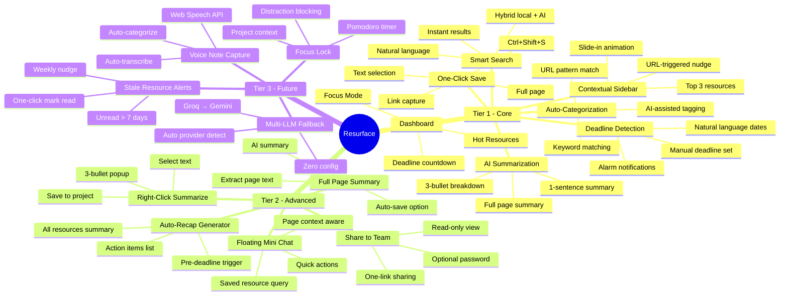

### Tier 1: Core Features (Must Demo)

| # | Feature | Trigger | Input | Output | Demo Time |
|:---|:---|:---|:---|:---|:---|
| 1 | **One-Click Save** | `Ctrl+Shift+S` | URL, text selection, or full page | Saved resource with auto-summary | 0:15 |
| 2 | **Auto-Categorization** | Automatic on save | Resource content + project keywords | Assigned project + tags | 0:20 |
| 3 | **AI Summarization** | Automatic on save | Raw content | 1-sentence + 3-bullet summary | 0:20 |
| 4 | **Deadline Detection** | Automatic from text | Content with date mentions | Extracted deadline + alarm | 0:25 |
| 5 | **Dashboard + Focus Mode** | Click extension icon | All saved resources | Urgency-sorted filtered view | 0:45 |
| 6 | **Contextual Sidebar** | Visit project-linked URL | Current tab URL | Slide-in panel with top resources | 1:00 |
| 7 | **Smart Search** | Type in search bar | Natural language query | Ranked resource results | 1:15 |

### Tier 2: Advanced Features (Demo if Time)

| # | Feature | Trigger | Input | Output | Demo Time |
|:---|:---|:---|:---|:---|:---|
| 8 | **Floating Mini Chat 💬** | Click floating button | Natural language question | Contextual answer + saved items | 1:30 |
| 9 | **Right-Click Summarize** | Select text → Right-click | Selected text | 3-bullet summary notification | 1:45 |
| 10 | **Full Page Summary** | `Ctrl+Shift+S` (page mode) | Full page text | Comprehensive page summary | (with #1) |
| 11 | **Auto-Recap Generator** | Click in dashboard | Project resources | Pre-deadline 1-page recap | 1:50 |
| 12 | **Share to Team** | Click share button | Project selection | Read-only shareable link | 1:55 |

### Tier 3: Mention in Q&A

| # | Feature | Description |
|:---|:---|:---|
| 13 | **Multi-LLM Auto-Fallback** | Detects available keys, uses Groq → Gemini fallback |
| 14 | **Stale Resource Alerts** | Nudges about saved-but-unread items older than 7 days |
| 15 | **Voice Note Capture** | Transcribe and save voice notes via Web Speech API |
| 16 | **Focus Lock** | Pomodoro-style deep work with distraction blocking |

---

## 🔄 User Flow Diagrams

### Primary Flow: Save → Categorize → Resurface

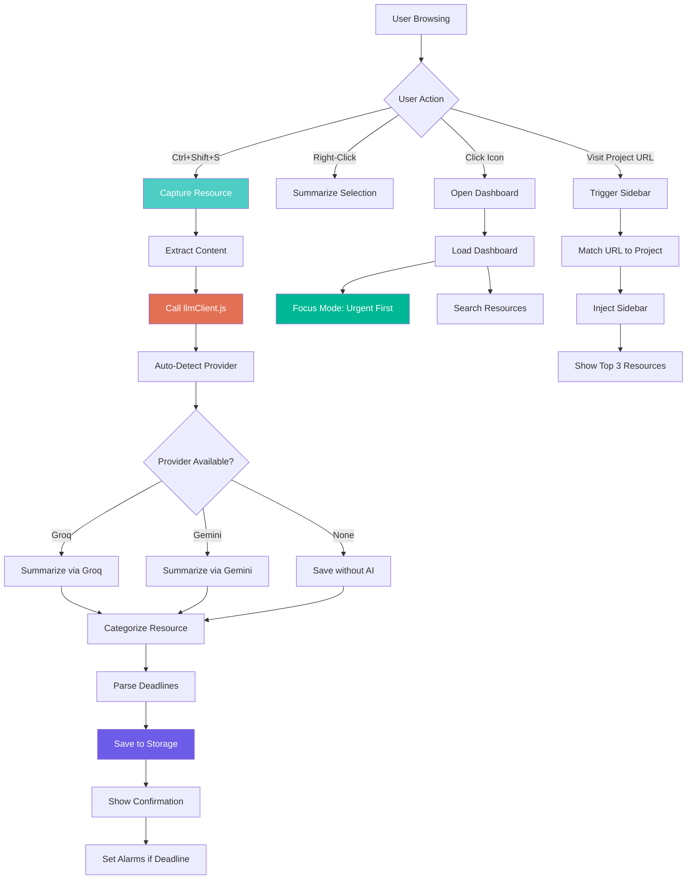

### AI Provider Selection Flow

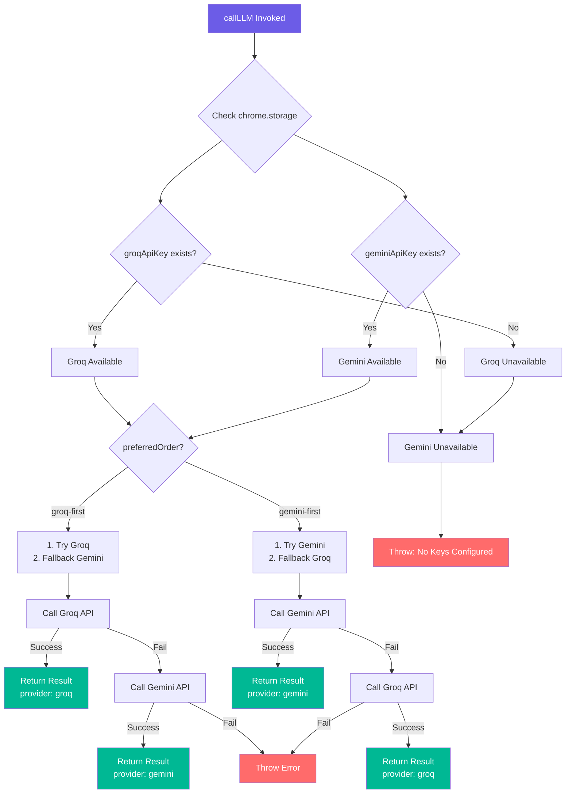

---

## 🛠️ Tech Stack

| Category | Technology | Version | Purpose |
|:---|:---|:---|:---|
| **Extension Framework** | Chrome Extensions API | Manifest V3 | Extension lifecycle, permissions, APIs |
| **Frontend Framework** | React | 18.3+ | Dashboard UI components |
| **Build Tool** | Vite | 5.x | Fast bundling with HMR support |
| **Styling** | Tailwind CSS | 3.4+ | Utility-first responsive design |
| **Charts** | Recharts | 2.12+ | Usage analytics, project insights |
| **Animation** | Framer Motion | 11.x | Sidebar slide-in, transitions |
| **Icons** | Lucide React | latest | Consistent icon library |
| **Primary AI** | Groq API (Llama 3.1 8B) | — | Summarization, categorization, search |
| **Fallback AI** | Gemini API (Gemini 2.0 Flash) | — | Automatic fallback when Groq fails |
| **Storage** | chrome.storage.local | — | All user data (5 MB limit) |
| **Storage (Settings)** | chrome.storage.sync | — | Cross-device preferences (100 KB) |
| **Voice** | Web Speech API | — | Voice note capture & transcription |
| **Alarms** | Chrome Alarms API | — | Deadline countdown notifications |
| **Shortcuts** | Chrome Commands API | — | Ctrl+Shift+S global shortcut |
| **Context Menus** | Chrome Context Menus API | — | Right-click "Summarize" option |
| **Tab Detection** | Chrome Tabs API | — | URL matching for contextual sidebar |
| **Notifications** | Chrome Notifications API | — | Desktop deadline alerts |

---

## 📦 Dependencies

### package.json

```json
{
  "name": "resurface",
  "version": "1.0.0",
  "description": "Deadline-aware knowledge companion — save anything, find it when you need it",
  "type": "module",
  "scripts": {
    "dev": "vite",
    "build": "vite build",
    "preview": "vite preview",
    "lint": "eslint src/",
    "format": "prettier --write src/",
    "test": "jest",
    "test:e2e": "playwright test"
  },
  "dependencies": {
    "react": "^18.3.1",
    "react-dom": "^18.3.1",
    "react-router-dom": "^6.23.0",
    "recharts": "^2.12.7",
    "lucide-react": "^0.378.0",
    "framer-motion": "^11.1.7",
    "clsx": "^2.1.1",
    "uuid": "^9.0.1"
  },
  "devDependencies": {
    "@vitejs/plugin-react": "^4.2.1",
    "vite": "^5.2.0",
    "tailwindcss": "^3.4.3",
    "postcss": "^8.4.38",
    "autoprefixer": "^10.4.19",
    "eslint": "^8.57.0",
    "prettier": "^3.2.5",
    "jest": "^29.7.0",
    "@playwright/test": "^1.43.1"
  }
}
```

### manifest.json

```json
{
  "manifest_version": 3,
  "name": "Resurface",
  "version": "1.0.0",
  "description": "Save anything now. AI categorizes and resurfaces when deadlines hit.",
  "permissions": [
    "storage",
    "contextMenus",
    "tabs",
    "alarms",
    "notifications",
    "scripting",
    "activeTab"
  ],
  "host_permissions": [
    "<all_urls>"
  ],
  "background": {
    "service_worker": "src/background/index.js",
    "type": "module"
  },
  "action": {
    "default_popup": "src/popup/index.html",
    "default_title": "Resurface",
    "default_icon": {
      "16": "public/icons/icon-16.png",
      "48": "public/icons/icon-48.png",
      "128": "public/icons/icon-128.png"
    }
  },
  "commands": {
    "save-resource": {
      "suggested_key": {
        "default": "Ctrl+Shift+S",
        "mac": "Command+Shift+S"
      },
      "description": "Save current page or selection to Resurface"
    }
  },
  "icons": {
    "16": "public/icons/icon-16.png",
    "48": "public/icons/icon-48.png",
    "128": "public/icons/icon-128.png"
  },
  "content_scripts": [
    {
      "matches": ["<all_urls>"],
      "js": ["src/content/contentScript.js"],
      "run_at": "document_idle"
    }
  ],
  "web_accessible_resources": [
    {
      "resources": ["src/content/sidebar/*", "src/content/chat/*"],
      "matches": ["<all_urls>"]
    }
  ]
}
```

---

## 📅 Implementation Phases

### Phase Timeline

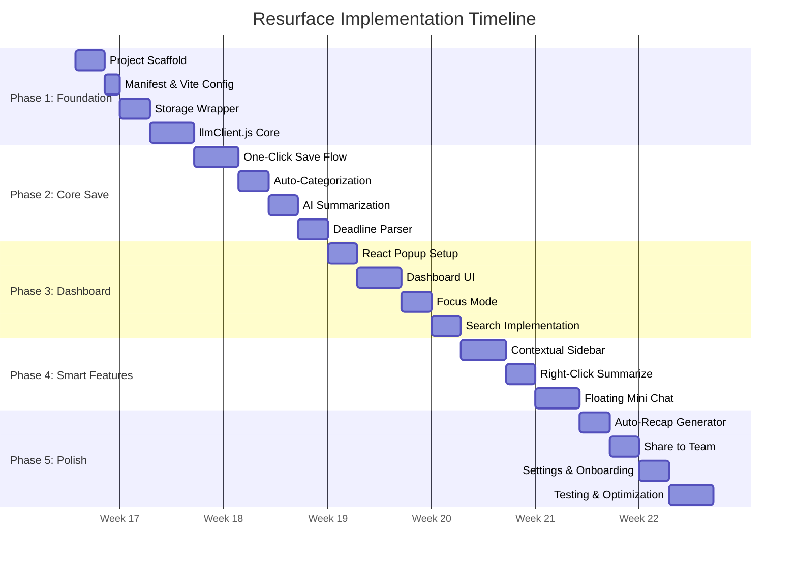

### Phase 1: Foundation (Days 1-8)

**Goal:** Working extension skeleton with AI connectivity

| Day | Task | Files | Milestone |
|:---|:---|:---|:---|
| 1-2 | Project scaffold | `package.json`, `vite.config.js`, `tailwind.config.js` | Build runs |
| 3 | Manifest setup | `manifest.json`, icons | Extension installs |
| 4-5 | Storage wrapper | `utils/storage.js` | CRUD operations work |
| 6-8 | llmClient.js | `utils/llmClient.js` | AI calls succeed |

**Checkpoint:** Extension loads in Chrome. Storage works. Can call Groq/Gemini.

### Phase 2: Core Save Flow (Days 9-16)

**Goal:** Ctrl+Shift+S captures and enriches resources

| Day | Task | Files | Milestone |
|:---|:---|:---|:---|
| 9-11 | One-Click Save | `background/commands.js`, `background/messageHandler.js` | Shortcut saves to storage |
| 12-13 | Auto-Categorization | `utils/categorizer.js` | Resources auto-tagged |
| 14-15 | AI Summarization | `utils/summarizer.js` | Summaries generated |
| 16 | Deadline Parser | `utils/deadlineParser.js`, `background/alarms.js` | Deadlines detected |

**Checkpoint:** Ctrl+Shift+S → resource saved with summary, category, and deadline.

### Phase 3: Dashboard (Days 17-24)

**Goal:** Beautiful popup dashboard for viewing and managing resources

| Day | Task | Files | Milestone |
|:---|:---|:---|:---|
| 17-18 | React popup setup | `popup/index.html`, `popup/main.jsx`, `popup/App.jsx` | React renders |
| 19-21 | Dashboard UI | `popup/components/Dashboard.jsx`, `ProjectCard.jsx`, `ResourceItem.jsx` | Full dashboard |
| 22-23 | Focus Mode | `popup/components/FocusMode.jsx` | Urgency filter works |
| 24 | Smart Search | `popup/components/SearchBar.jsx`, `utils/smartSearch.js` | NL search functional |

**Checkpoint:** Click extension icon → beautiful dashboard with search and focus mode.

### Phase 4: Smart Features (Days 25-32)

**Goal:** Proactive resur facing and in-page AI features

| Day | Task | Files | Milestone |
|:---|:---|:---|:---|
| 25-27 | Contextual Sidebar | `content/sidebarInjector.js`, `background/tabListener.js` | Sidebar slides in |
| 28-29 | Right-Click Summarize | `background/contextMenus.js`, `content/contentScript.js` | Right-click works |
| 30-32 | Floating Mini Chat | `content/floatingChat.js` | Chat functional on any page |

**Checkpoint:** Proactive sidebar nudges. Right-click summarize. Floating chat on pages.

### Phase 5: Polish (Days 33-42)

**Goal:** Production-ready with all advanced features

| Day | Task | Files | Milestone |
|:---|:---|:---|:---|
| 33-34 | Auto-Recap Generator | `utils/recapGenerator.js`, `RecapGenerator.jsx` | Recaps generated |
| 35-36 | Share to Team | `SharePanel.jsx`, share view | Sharing works |
| 37-38 | Settings & Onboarding | `Settings.jsx`, `Onboarding.jsx`, `ApiStatus.jsx` | UX complete |
| 39-42 | Testing & Optimization | Tests, error handling, performance | Production ready |

**Checkpoint:** Complete extension ready for Chrome Web Store submission.

---

## 🔌 API Integration Details

### API Comparison

| Aspect | Groq | Gemini |
|:---|:---|:---|
| **Model** | Llama 3.1 8B Instant | Gemini 2.0 Flash |
| **Free Tier RPM** | 30 requests/minute | 15 requests/minute |
| **Free Tier TPM** | 6,000 tokens/minute | 32,000 tokens/minute |
| **Latency** | ~0.5 seconds | ~1.2 seconds |
| **Max Context** | 131,072 tokens | 1,048,576 tokens |
| **Format** | OpenAI-compatible | Gemini-native (converter needed) |
| **Key Cost** | $0 (free tier) | $0 (free tier) |
| **Signup** | [console.groq.com](https://console.groq.com) | [aistudio.google.com](https://aistudio.google.com) |

### API Call Distribution

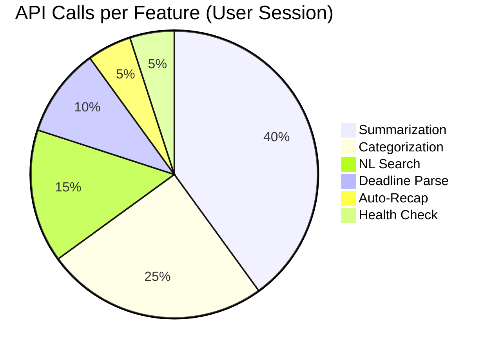

### Usage Estimates

| Feature | Tokens In | Tokens Out | Calls/User/Day | Daily Tokens |
|:---|:---|:---|:---|:---|
| Save + Summarize | ~500 | ~100 | 20 | 12,000 |
| Categorization | ~300 | ~50 | 20 | 7,000 |
| NL Search | ~200 | ~100 | 10 | 3,000 |
| Right-Click Summary | ~1,000 | ~150 | 5 | 5,750 |
| Auto-Recap | ~2,000 | ~500 | 1 | 2,500 |
| **Total** | | | **~56 calls** | **~30,250 tokens** |

**Both Groq and Gemini free tiers easily cover personal use.**

---

## 🎬 Demo Script

### 2-Minute Demo Flow

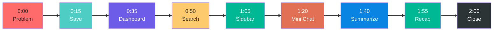

| Time | Visual | Action | Lines |
|:---|:---|:---|:---|
| **0:00** | Chaotic browser, tabs everywhere, deadline visible | Show problem state | *"You've done the research. Bookmarks everywhere. Notes in three apps. But the deadline is in 2 hours. Where is everything?"* |
| **0:15** | Highlight text about VC pitching, press Ctrl+Shift+S | **One-Click Save** | *"Just press Ctrl+Shift+S. Resurface captures it, summarizes it with AI, knows it's for HackIndia, and spots the deadline."* |
| **0:35** | Click extension icon, dashboard opens | **Dashboard + Focus Mode** | *"Open the dashboard. Focus Mode shows only what's urgent. Hot Resources bubble up what you use most. 2 hours left — not 2 weeks."* |
| **0:50** | Type in search bar | **Smart Search** | *"Or just ask: 'What was that API article I saved last week?' AI search finds it instantly."* |
| **1:05** | Open github.com/team repo | **Contextual Sidebar** | *"Now open your project repo. Resurface knows — it slides in a sidebar: 'Working on HackIndia? Here's what you saved.' No searching. No remembering."* |
| **1:20** | Click floating chat bubble | **Floating Mini Chat 💬** | *"Even a mini chat on any page. 'Did I save anything about this topic?' It searches your saved resources while you work."* |
| **1:40** | Select text on a page, right-click, "Resurface Summarize" | **Right-Click Summarize** | *"Found something new? Select it, right-click, 3-bullet summary instantly. Save it to your project in one click."* |
| **1:55** | Click "Generate Recap" in dashboard | **Auto-Recap** | *"And before the deadline, one click gives you a full recap of everything you saved — key links, insights, action items."* |
| **2:00** | Logo + tagline | **Close** | *"Resurface. Save anything now. AI finds it when deadlines hit."* |

---

## 🚀 Deployment Guide

### Method Comparison

| Method | Cost | Setup Time | Auto-Update | Best For |
|:---|:---|:---|:---|:---|
| **Developer Mode** | $0 | 2 minutes | ❌ Manual reload | Development, personal use |
| **Private (Unlisted)** | $5 (one-time) | 2-3 days | ✅ Automatic | Sharing with teammates |
| **Public Listing** | $5 (one-time) | 2-3 days | ✅ Automatic | Public launch, startup |

### Developer Mode (Immediate)

```bash
# 1. Build the extension
npm run build

# 2. Open Chrome
# Navigate to: chrome://extensions/

# 3. Enable "Developer mode" (toggle, top right)

# 4. Click "Load unpacked"
# Select the /dist folder

# 5. Extension appears in toolbar — ready to use
```

### Chrome Web Store (Private/Unlisted)

```bash
# 1. Pay one-time $5 developer fee
# Visit: https://chrome.google.com/webstore/devconsole

# 2. Build production version
npm run build

# 3. Zip the /dist folder
zip -r resurface-v1.0.0.zip dist/

# 4. Upload to Chrome Web Store Developer Dashboard
# Set visibility to "Unlisted"

# 5. Share the private link with teammates
# They click → "Add to Chrome" → Installed
```

### Chrome Web Store (Public)

```bash
# Same as Private, but set visibility to "Public"
# Requires: description, screenshots, privacy policy
# Review time: 24-48 hours per update
```

---

## 💰 Future Monetization Path

### When You're Ready to Launch as a Startup

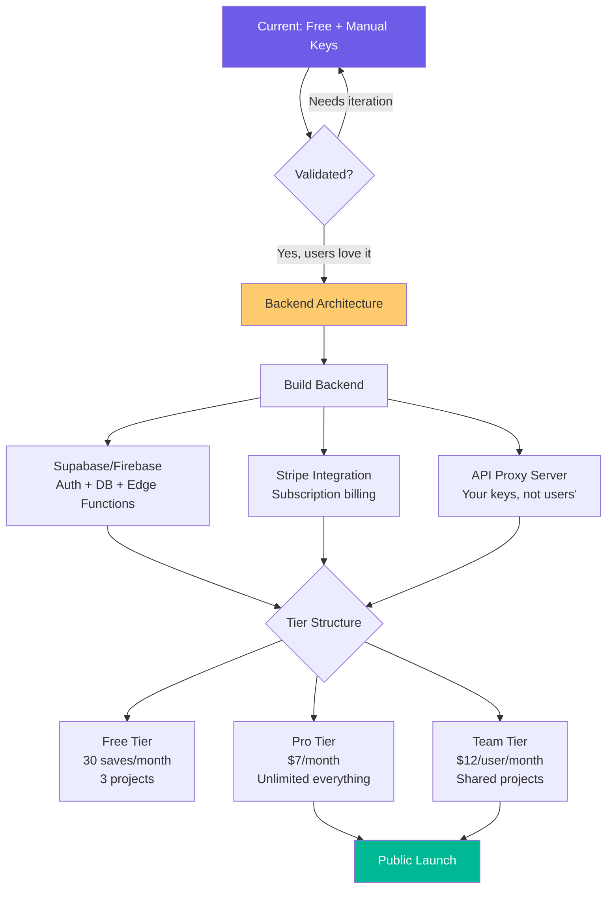

### Backend Architecture (Future)

| Component | Technology | Purpose |
|:---|:---|:---|
| **Auth** | Supabase Auth / Clerk | User accounts, JWT tokens |
| **Database** | Supabase PostgreSQL | User data, resources, projects |
| **API Proxy** | Supabase Edge Functions | Hides Groq/Gemini keys from users |
| **Sync** | Real-time subscriptions | Cross-device sync |
| **Billing** | Stripe | Subscription management |
| **Analytics** | PostHog / Mixpanel | Usage tracking, retention |

### Why This Matters Now

Even though Resurface is free/manual-keys today, you're building the architecture that makes monetization easy later:

1. **llmClient.js abstraction** — swap from client-side to server-side API calls without changing feature code
2. **Storage wrapper** — swap chrome.storage.local for Supabase with same interface
3. **Settings page** — already has API key management; add login/signup flow

---

## 🏁 Ready to Build

This document contains everything needed to build Resurface v2.0:

- ✅ Complete architecture with diagrams
- ✅ Multi-LLM auto-detection & fallback
- ✅ Full project structure
- ✅ Data models with relationships
- ✅ Core implementation code (llmClient.js)
- ✅ Feature catalog with priorities
- ✅ User flow diagrams
- ✅ Implementation phases with timeline
- ✅ API integration details
- ✅ Demo script structure
- ✅ Deployment options
- ✅ Future monetization path

---

> **Resurface: Save anything now. AI categorizes and summarizes. Find it with natural language. Dual-LLM with automatic fallback — it adapts to whichever API keys you have.**

---

*Generated for Resurface v2.0 — April 2025*